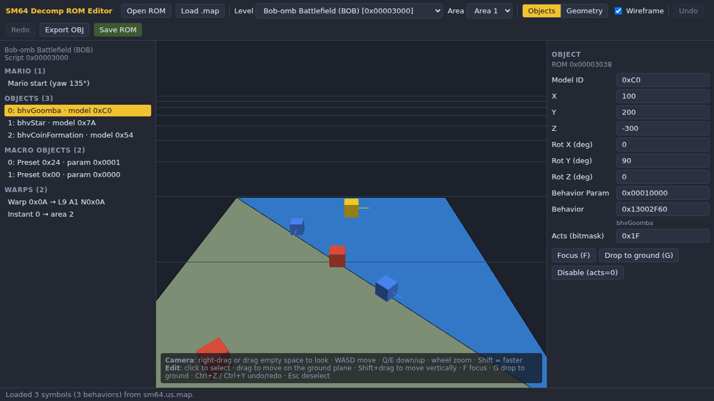

# SM64-Decomp-Rom-Editor

A graphical **object placement** and **collision geometry** editor for Super Mario 64
`.z64` ROMs built from the [SM64 decompilation](https://github.com/n64decomp/sm64). It works like
Toad's Tool 64 and Quad64, but runs in the browser and has no dependencies.



## Features

- Opens `.z64` ROMs built from the decomp (US/JP/EU…), plus vanilla dumps in `.z64`, `.v64` or `.n64`
  byte order.
- Finds every level script by scanning for the `EXECUTE(0x0E, …)` commands that load them. Levels
  are named from the `JUMP_IF(OP_EQ, LEVEL_x, …)` table in the main scripts segment. Nothing depends
  on hard-coded ROM offsets, so shifted or modded decomp builds work too.
- Reads level data compressed with **MIO0** (vanilla / older decomp) or **Yay0** (newer decomp), or
  stored uncompressed (`COMPRESS=uncomp`).
- **Object mode**: view and edit, per area:
  - placed objects (`OBJECT` / `OBJECT_WITH_ACTS`): position, rotation, model ID, behavior,
    behavior parameter and act mask (set acts to 0 to disable an object),
  - macro objects: preset, yaw, position, behavior parameter,
  - Mario's start position (`MARIO_POS`),
  - warp nodes, painting warps and instant warps.
- **Geometry mode**: the area's collision mesh is drawn colored by surface type. Click a triangle
  to select it and its nearest vertex, then drag the vertex or type new coordinates. You can also
  change the surface type of a surface group.
- Free-fly 3D camera. Click and drag to place things on the ground plane (Shift+drag changes
  height). Also includes "drop to ground" and undo/redo.
- Optional: load the decomp build's linker map (`build/us/sm64.us.map`) to see behavior names
  (`bhvGoomba`, …) and to type behavior names instead of addresses.
- Export an area's collision as a Wavefront `.obj`.
- **Save ROM** writes edits back in place. Compressed segments are recompressed; if one no longer
  fits, it is moved to the end of the ROM and its `LOAD_*` command is updated. The CIC-6102 header
  checksum is recalculated.

## Running

Browsers can't load ES modules from `file://` URLs, so the folder has to be served over HTTP. With
Node.js 18+:

```sh
npm start            # http://127.0.0.1:8064
```

Any static file server also works (for example `python3 -m http.server`), and the editor can be
hosted on GitHub Pages without changes.

Open the page, click **Open ROM** (or drag and drop the ROM onto the window), pick a level and an
area, and edit. Click **Save ROM** to download the edited ROM as `<name>.edited.z64`.

### Controls

| Action | Input |
| --- | --- |
| Look around | Right-drag, or left-drag on empty space |
| Move camera | `W` `A` `S` `D`, `Q`/`E` down/up, mouse wheel, middle-drag to pan; hold `Shift` for speed |
| Select | Left-click in the 3D view or in the outline |
| Move selection | Left-drag (ground plane), `Shift`+drag (vertical) |
| Focus selection / drop to ground | `F` / `G` |
| Undo / redo | `Ctrl+Z` / `Ctrl+Y` (or `Ctrl+Shift+Z`) |
| Deselect | `Esc` |

## How edits are stored

All edits are made **in place**, so data never has to be resized:

- Objects, Mario's start and warps live in the level script (segment `0x0E`). It is stored
  uncompressed and patched directly.
- Collision and macro objects live in the level data segment (usually `0x07`). On save it is
  decompressed, edited and recompressed in the same format.
- Collision edits keep the data the same size. You can move vertices and change surface types, but
  switching between a surface type with a "force" parameter and one without is rejected, because
  that would change the size of every triangle in the group.

Changes to a level are applied to the in-memory ROM when you switch levels or save.

## Project layout

```
index.html            UI shell
server.js             zero-dependency static server (npm start)
src/core/             ROM / level parsing and writing (no DOM, runs in Node too)
  rom.js              byte order handling, checksum
  compression.js      MIO0 / Yay0 codecs
  level.js            level discovery, level script walker, commit/relocation
  entities.js         editable objects, macro objects, warps, Mario start
  collision.js        collision parser/editor, OBJ export
  mapfile.js          GNU ld .map parser for symbol names
  names.js            level, command and surface type names
src/ui/               WebGL renderer, camera math and the editor app
test/                 node:test suite using synthetic ROM fixtures
```

## Tests

```sh
npm test
```

The tests build small synthetic ROMs (see `test/fixtures.js`), so you don't need a copyrighted ROM
to run them.

## Limitations / roadmap

- The 3D view shows collision geometry only, not the textured visual (Fast3D display list)
  geometry.
- Collision special objects (`COL_SPECIAL_INIT`) are kept as-is but can't be edited yet.
- Adding or removing objects, and importing new level models, would need the level script and
  data segments to grow. That isn't supported yet.
